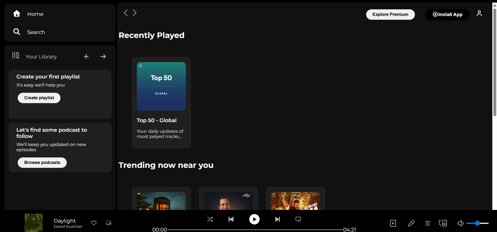

# Spotify Web Player UI Clone 🎧

A frontend UI clone of Spotify’s web player built using **HTML and CSS** as part of a
guided learning project.

## About the Project
This project focuses on recreating the layout and visual structure of Spotify’s web player
to improve understanding of real-world UI design.

## Tech Stack
- HTML5
- CSS3 (Flexbox, Media Queries)
- Font Awesome
- Google Fonts

## Features
- Sidebar navigation layout
- Card-based content sections
- Sticky top navigation bar
- Bottom music player UI
- Responsive layout with hover effects

## Live Demo

## Preview

## What I Learned
- Structuring large HTML layouts
- Writing maintainable CSS
- Handling responsiveness
- Translating a real product UI into code

## Note
This is a **UI clone for learning purposes only**.
No backend functionality or music playback is implemented.
